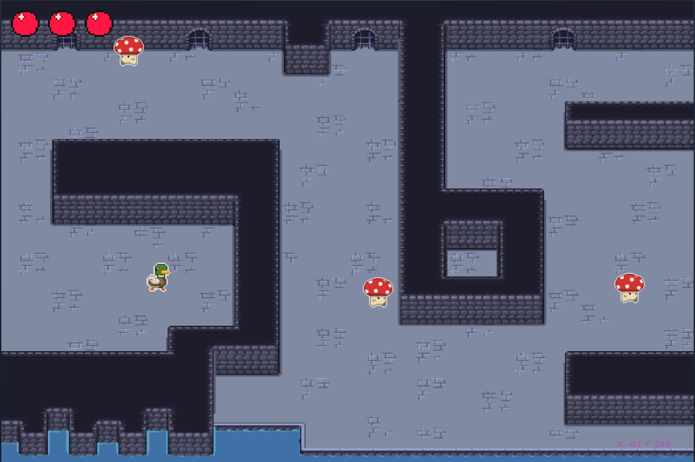

# Projet GAME-JAM

## Membres 
FOLLIARD Florent
VIVIEN Oscar
SPORTES Joey
TRAORE Mohamed

Retrouvez notre jeu sur [Itch.io](https://flx8.itch.io/game-jam-des-bg)

### Objectifs du projet
Ce projet a pour objectif de mettre en pratique le langage **Javascript** pour l'intégrer dans le backend d'un jeu type Game Jam.

Aperçu du 1er niveau :



<details>
<summary> Arborescence structurelle du projet 📂</summary>

```
assets/
├── button/
│   ├── Play-Click.png
│   └── Play-Idle.png
│
├── hp/
│   ├── hpP.png
│   └── hpV.png
│
├── hp mp/
│   └── Heart&ManaUi.png
│
├── map/
│
├── personnage/
│   ├── (jean)Slime/
│   │   ├── Slime1/
│   │   └── Slime2/
│   │
│   ├── Canards/
│   │   ├── duck1/
│   │   ├── duck2/
│   │   ├── ducky_2_spritesheet.png
│   │   └── ducky_3_spritesheet.png
│   │
│   ├── Mort/
│   │   ├── Reaper (Animated Pixel Art)/
│   │   ├── mp1.png
│   │   └── mp2.png
│   │
│   └── Mushroom/
│       ├── sprite/
│       └── champi.png
│
src/
├── collisions.js
├── enemy.js
├── map.js
├── player.js
└── sketch.js

index.html
README.md
style.css
```
</details>